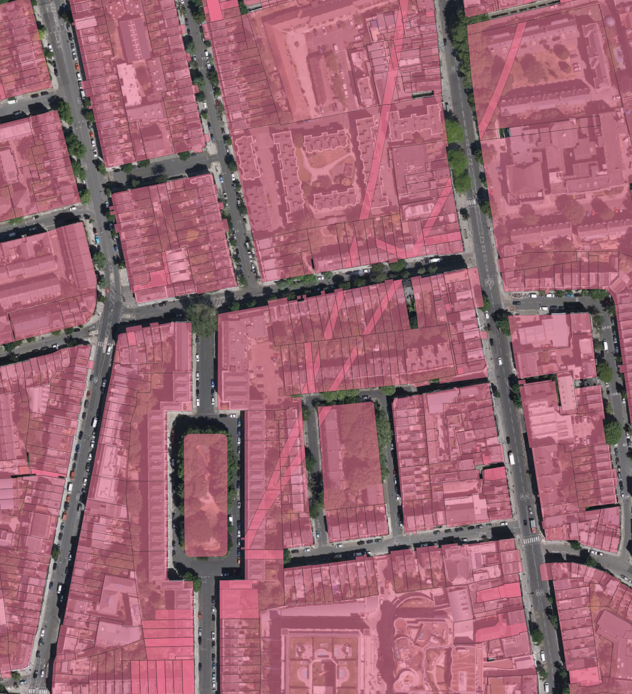
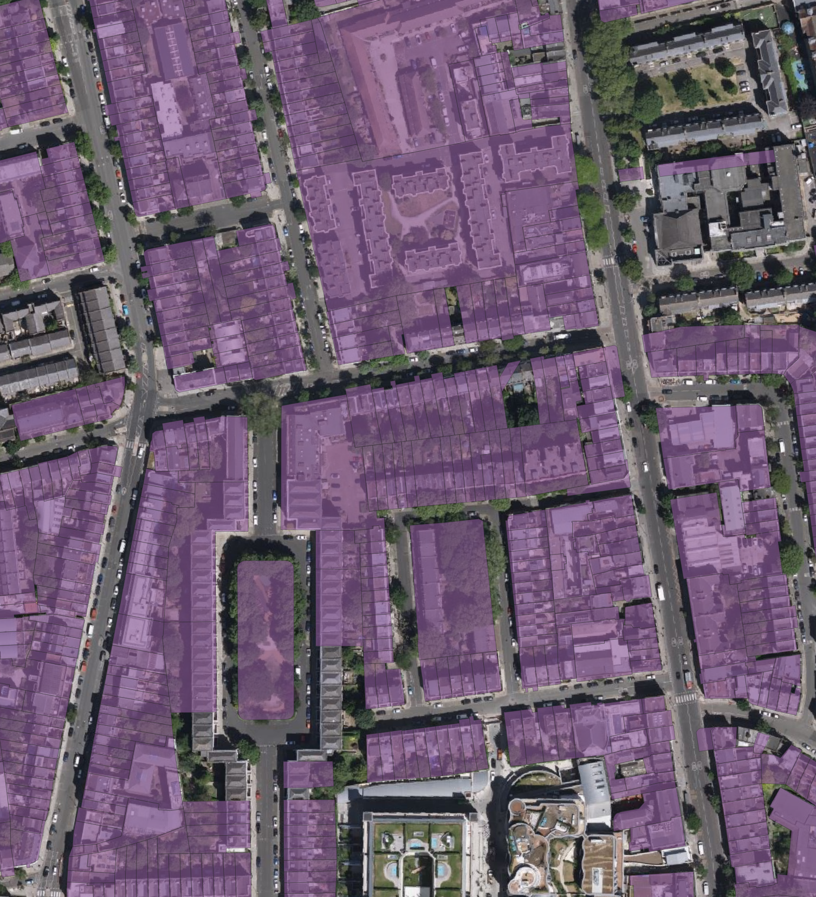
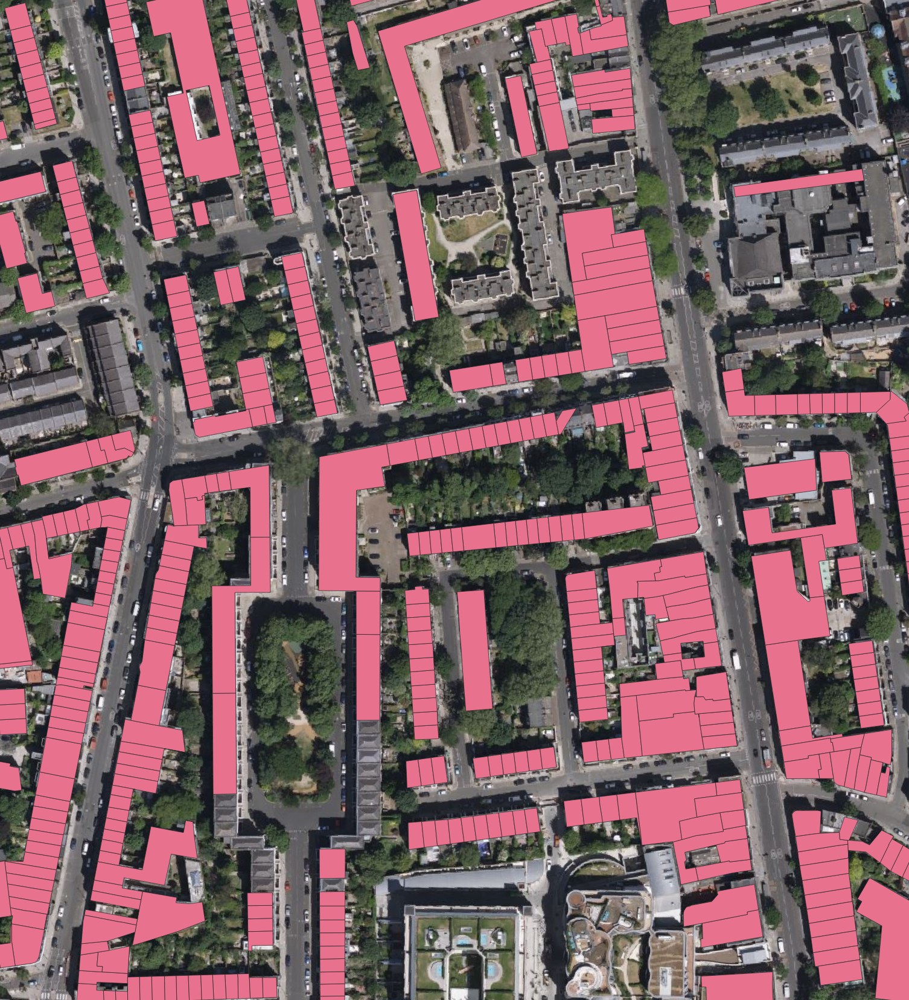

# OSM UK Address Points

Geoprocessing approaches for the OSMUK addressing project. The goal of this project is to produce a representative point for every UK address to aid in address mapping.

This README describes two approaches to achieve this.

The London borough of Islington is used for examples, as it includes a good selection of issues including underground tunnels and a decent amount of council-owned property.

## INSPIRE / OS OpenMap method

This method was originally suggested, and entails splitting building polygons from OS OpenMap Local using the Land Registry INSPIRE parcel boundaries.

### Challenges

The Land Registry data includes a significant number of overlapping parcels - these are broadly split into two categories:

**Overlapping parcels at ground level**: these are most likely to be leasehold vs freehold. In some places these parcels are exactly the same size, while in other cases there are larger parcels containing smaller ones, where we're only interested in the smallest parcels.

**Underground parcels (tunnels):** These can show up in several forms, with the geometry of the parcel either following the geometry of the tunnel, or duplicating the geometry of the parcels at ground level. In some cases, the geometry of the tunnel is split by the parcel boundary at ground level, which results in overlapping parcels of similar size.

The following example from Islington shows an example of each of these overlaps, with the Victoria Line parcels following the tunnel geometry to the north, and mirroring the property boundaries at ground level to the south.



The INSPIRE data does not provide any metadata with which to deduplicate these overlapping parcels, so this must be done by geometry alone. This is a challenge where underground parcels have a different geometry, but a similar size, to ground-level parcels.

### Processing 

Firstly, filter land registry parcels to remove those with excessively large or small areas. Remove intersecting parcels, while trying to identify parcels which are more likely to be the ground-level parcels using a compactness metric. Where roughly identical parcels exist, choose the one with the lowest INSPIRE ID. (`inspire_filtered` view.)



Secondly, intersect these parcels with building polygons from OS OpenMap Local. Filter out tiny buildings, and choose the largest polygon from each land registry parcel. (`split_buildings` view.)



Lastly, pick a representative point inside each building polygon. This is the output. The count of UPRN points covered by this polygon is also included as an attribute, because it was relatively simple to do. (`split_building_centroids` view.)


[Example GeoJSON File (Islington)](./output/islington.json)

## UPRN Method

As an alternative to using the land registry data, I also explored an alternative approach by clipping UPRN points which intersect with building outlines, and summarising these points by location. (`uprn_buildings` view.)


This approach likely provides better coverage of addressing points, and it is a simpler approach in general.

It includes many addresses which are missed by the previous approach because they are council-owned and do not have their own INSPIRE parcel. However, it can be more noisy when properties have many addresses - it's possible that further filtering could improve this slightly.

The overall accuracy of these points seems to be roughly equivalent to the previous method.

[Example GeoJSON File (Islington)](./output/islington.json)

## Processing Notes

Import data with:
```
ogr2ogr -f PostgreSQL -nln buildings 'PG:host=127.0.0.1 port=5433 user=osm password=osm dbname=osm_addresses' ./TQ.gml Building
ogr2ogr -f PostgreSQL -nln inspire 'PG:host=127.0.0.1 port=5433 user=osm password=osm dbname=osm_addresses' ./Land_Registry_Cadastral_Parcels.gml
ogr2ogr -f PostgreSQL -nln uprn 'PG:host=127.0.0.1 port=5433 user=osm password=osm dbname=osm_addresses' ./osopenuprn_202107.gpkg
```

SQL is available in (schema.sql)[./schema.sql].
